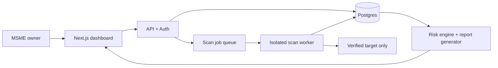

# CyberSure MSME — Implementation Plan

## 1. MVP outcome

Build a consent-gated web application that lets an MSME owner verify a domain they own, run a low-impact posture assessment, and receive a plain-language, prioritised remediation plan in English, Hindi, or Hinglish.

The MVP deliberately performs no exploitation, brute forcing, broad discovery, or scans of unverified assets.

## 2. Product flow

1. User creates an account and business profile.
2. User registers one HTTPS target URL.
3. Platform generates a one-time verification token.
4. User proves ownership using either a DNS TXT record or a file at `/.well-known/cybersure-verification.txt`.
5. User reviews the scan scope and accepts explicit consent.
6. Platform runs low-impact checks against the verified host.
7. Findings are normalised, risk-scored, and translated into owner and developer views.
8. User marks a remediation as fixed and starts a comparison re-scan.
9. User downloads an executive Markdown/PDF report.

## 3. Recommended stack

| Area | Recommendation | Reason |
|---|---|---|
| Web app | Next.js + TypeScript | Fast dashboard and API development in one project |
| UI | Tailwind CSS + shadcn/ui | Polished hackathon UI with accessible components |
| Database/auth | Supabase (Postgres + Auth) | Quick managed auth, relational data, and audit trail |
| Background scans | Node worker / BullMQ + Redis | Keeps scans outside request lifecycle and supports status updates |
| Web checks | Native `fetch`, TLS socket inspection, HTML parser | Enables transparent, low-impact checks without attack tooling |
| Passive baseline | OWASP ZAP Baseline in a sandboxed container | Recognised passive assessment evidence; optional if time is tight |
| Code scan | Semgrep Community Edition in a sandboxed container | Optional scan of an uploaded ZIP with useful rule evidence |
| Reports | Markdown template, then PDF rendering | Reliable first; PDF is a presentation enhancement |
| Deployment | Vercel for app + Render/Railway worker, or fully local demo | Separates public UI from scan execution |

For a time-limited demo, ship custom checks first. Treat ZAP and Semgrep as integrations behind a feature flag, so their absence never blocks the core journey.

## 4. Architecture

Security boundaries:

- Store a verified hostname, not arbitrary user-supplied scan URLs.
- Resolve DNS immediately before scanning; reject private, loopback, link-local, multicast, and cloud-metadata IP ranges to prevent SSRF.
- Permit HTTPS by default, only GET/HEAD requests, a fixed small path allowlist, low rate limits, short timeouts, and no redirects to another host.
- Run ZAP/Semgrep in restricted containers with CPU, memory, duration, and network limits.
- Record verification, consent text/version, scan time, and scope in an audit log.

## 5. Data model

| Entity | Key fields |
|---|---|
| `users` | id, email, display_name, preferred_language |
| `businesses` | id, owner_id, name, sector, employee_range, handles_customer_data |
| `targets` | id, business_id, canonical_origin, hostname, verification_method, verification_token, verification_status, verified_at |
| `consents` | id, target_id, user_id, scope_version, accepted_at, ip_address |
| `scans` | id, target_id, started_at, completed_at, status, scanner_version, score |
| `findings` | id, scan_id, rule_id, category, severity, title, evidence_json, owner_explanation, developer_guidance, remediation_status |
| `code_uploads` | id, business_id, object_path, status, expires_at |
| `audit_events` | id, actor_id, target_id, event_type, metadata_json, created_at |

## 6. Scan rules for the first release

| Rule | Method | Severity guidance | Owner-facing outcome |
|---|---|---|---|
| HTTPS/TLS unavailable or invalid | TLS handshake and certificate inspection | High | Customer data may be exposed or trust warnings shown |
| HSTS missing | Response-header check | Medium | Users may be downgraded to an unsafe connection |
| CSP missing/weak | Response-header check | Medium | Browser has fewer protections against injected content |
| `X-Content-Type-Options` missing | Response-header check | Low | Browser may misinterpret risky file content |
| Frame protection missing | CSP `frame-ancestors` / X-Frame-Options | Medium | Site could be embedded in a deceptive page |
| Cookie lacks `Secure` / `HttpOnly` / `SameSite` | Set-Cookie parser | Medium/High | Session data may be easier to steal or misuse |
| Mixed HTTP resources | Parse homepage HTML | Medium | Some page resources load without encryption |
| Public debug/config indicator | Fixed safe path allowlist and response-signature check | High | Technical details may expose the business to attack |
| Passive ZAP alerts | Imported baseline report | Scanner-provided, normalised | Additional evidence with plain next action |
| Semgrep findings (optional) | Upload-only isolated source scan | Rule-provided, normalised | Potential issue in the supplied code |

Avoid guessing an exposed directory from recursive crawling. The debug/config check should use only a short, documented allowlist and never fetch sensitive file contents.

## 7. Risk and prioritisation logic

Calculate a 0–100 security score from a weighted set of unresolved findings. Start at 100 and deduct severity weights, capped per rule category to avoid repetitive alerts distorting the score.

Suggested deductions: Critical 25, High 15, Medium 8, Low 3. Add a business-impact multiplier (for example, payment/customer-data handling) only after the base score works.

The “Fix first” list should rank by:

1. severity;
2. whether customer data or login sessions are affected;
3. estimated ease of remediation;
4. whether the issue remained in the latest re-scan.

Every result must include: evidence, why it matters, an actionable owner message, technical remediation, reference category, and status.

## 8. Dashboard screens

1. **Onboarding:** business profile and data/payment context.
2. **Target verification:** show token, DNS/file instructions, retry verification.
3. **Consent:** scope, permitted checks, exclusions, and acceptance checkbox.
4. **Assessment dashboard:** overall score, severity breakdown, top three fixes, scan status.
5. **Finding detail:** owner/developer language toggle, evidence, remediation, mark-fixed action.
6. **Re-scan comparison:** resolved, new, and persisting findings; score delta.
7. **Report export:** executive summary and technical appendix.

Use plain language by default. Hindi/Hinglish can be delivered through a curated message dictionary for the MVP, rather than unreliable automatic translation.

## 9. Delivery sequence

### Phase 0 — Foundation (half day)

- Create Next.js/TypeScript project, linting, formatting, environment schema, and README.
- Add Supabase project/schema or local Postgres equivalent.
- Define typed finding schema and fixture data.

**Done when:** a seeded dashboard renders a score and findings without invoking a scanner.

### Phase 1 — Safe access gate (half to one day)

- Implement signup/login and business profile.
- Implement target registration, URL canonicalisation, token generation, DNS/file verification, and consent capture.
- Add hostname/IP validation and audit events.

**Done when:** an unverified target cannot create a scan job; a verified demo target can.

### Phase 2 — Core assessment engine (one day)

- Implement a queued worker and scan status polling.
- Add TLS, headers, cookies, mixed-content, and safe debug-indicator checks.
- Normalise results and calculate score/priorities.

**Done when:** a controlled demo website produces deterministic findings with evidence.

### Phase 3 — Actionable experience (one day)

- Build dashboard, finding detail, owner/developer views, Hindi/Hinglish message dictionary, and mark-fixed workflow.
- Implement scan history and re-scan comparison.
- Generate downloadable Markdown report.

**Done when:** a user can go from a finding to a re-scan showing it resolved.

### Phase 4 — Integrations and polish (one day)

- Add ZAP baseline import behind a feature flag.
- Add optional ZIP upload and isolated Semgrep scan.
- Add PDF export, loading/error states, empty states, and mobile layout.

**Done when:** optional integrations fail safely and do not affect the custom-check flow.

### Phase 5 — Demo and hardening (half day)

- Prepare a deliberately vulnerable local demo target plus a remediated version.
- Write test cases, capture screenshots, rehearse the narrative, and verify no scanning occurs without consent.

**Done when:** the complete demo works from a clean browser session.

## 10. Test checklist

- Unit: URL/hostname canonicalisation, private-IP rejection, header/cookie parsing, score calculation, language message selection.
- Integration: file/DNS verification mocked, consent-to-job transition, scan-result persistence, re-scan comparison.
- Security: user A cannot access user B’s target or scans; redirects cannot escape the verified hostname; uploads reject unsafe archives; secrets are never displayed in evidence.
- Manual demo: scan the controlled vulnerable target, apply a predefined fix, re-scan, and export the report.

## 11. Hackathon demonstration script

1. Introduce Sakshi and her small online store.
2. Show target ownership verification and explicit scan consent.
3. Start a scan of the controlled staging/demo site.
4. Show the score and one high-impact cookie/TLS/header finding.
5. Switch from the owner explanation to developer evidence and remediation.
6. Apply the prepared fix, mark it fixed, and re-scan.
7. Show the improved score, resolved status, and downloadable report.

## 12. Definition of done

The MVP is ready when it demonstrably verifies target ownership, requires consent, safely scans only the verified demo target, presents at least five useful normalised checks, explains each finding in owner and developer language, compares a re-scan, and produces an exportable report.
