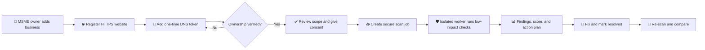
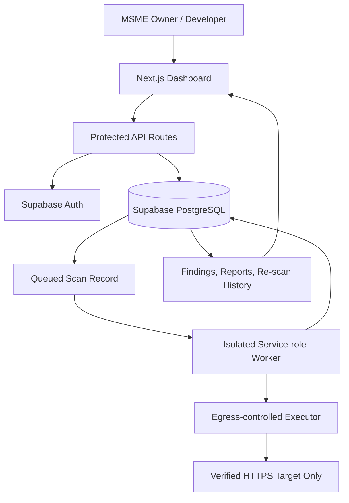
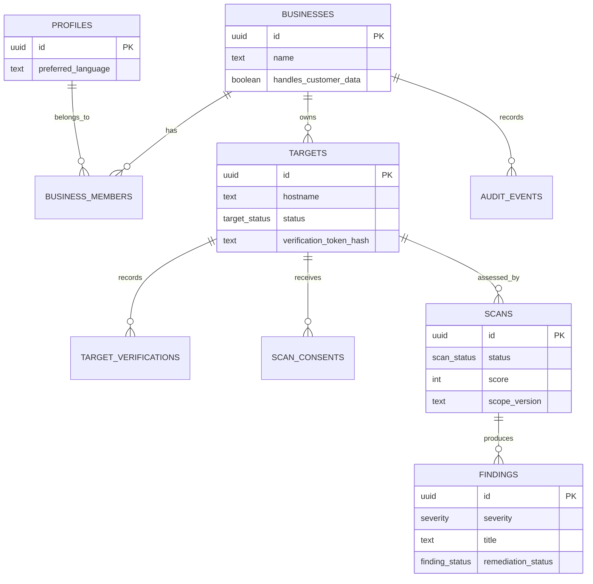

<div align="center">

# 🛡️ CyberSure MSME

### Affordable, consent-gated cybersecurity health checks for Indian small businesses

*Know what is exposed. Fix what matters first.*

[](https://nextjs.org/)
[](https://www.typescriptlang.org/)
[](https://supabase.com/)
[](#-responsible-security)
[](#-project-status)

**Developed by [Anasingaraju Tanmayee](#-team) and [Himanshu Yadav](#-team)**

</div>

---

## 🌟 Theme

**CyberSure MSME** is built around a simple idea: cybersecurity should feel like a practical business health check—not an intimidating technical audit.

The experience is calm, trustworthy, and accessible. It guides an MSME owner from *“I do not know whether my website is secure”* to *“Here are the most important safe fixes my developer can make today.”*

> **Theme:** *Secure growth for every small business.*

## 🎯 Problem statement

Indian MSMEs are rapidly adopting websites, payment links, cloud services, and digital customer records. Yet many cannot afford a professional cybersecurity assessment or interpret raw scanner reports. They need a safe and affordable answer to three questions:

1. **What is exposed?**
2. **What matters most to my business?**
3. **What can I fix today?**

Existing tools often produce difficult technical alerts, while full assessments can be expensive and may be inappropriate without explicit target ownership. CyberSure addresses this gap through verified ownership, explicit consent, low-impact assessment, multilingual explanations, and developer-ready remediation.

## 💡 Our solution

CyberSure MSME is a web platform that assesses only assets a business has verified as its own. It checks safe website-posture signals, turns them into a prioritised security score, and presents each result in two linked views:

| Business-owner view | Developer view |
|---|---|
| Plain-language impact in English, Hindi, or Hinglish | Evidence, affected control, remediation guidance, and retest status |
| “Customer login sessions may be exposed on unsafe Wi‑Fi.” | “Add the `Secure` attribute to authentication cookies.” |

It is **not** an autonomous penetration-testing, exploitation, brute-force, or third-party scanning platform.

## 🧭 Objectives

- Make cybersecurity posture assessment accessible to Indian MSMEs.
- Require proof of domain ownership and explicit consent before a scan.
- Perform only low-impact, time-bounded website configuration checks.
- Explain risks in language a business owner can act on.
- Give developers evidence-based remediation guidance.
- Track fixes through re-scans and clear before/after comparison.
- Create an auditable, secure workflow suitable for consultants and hackathon evaluation.

## ✨ Key features

| Feature | What it does |
|---|---|
| 🔐 **Ownership verification** | Generates a one-time token and verifies DNS TXT ownership before any assessment. |
| ✅ **Explicit consent** | Records the user, timestamp, target, and assessment scope version. |
| 🧪 **Low-impact checks** | Supports HTTPS/TLS, headers, cookies, mixed content, and safe fixed debug indicators. |
| 📊 **Risk score** | Produces a 0–100 score and ranks fixes by severity and impact. |
| 🗣️ **Multilingual owner guidance** | Provides English, Hindi, and Hinglish explanations. |
| 👩‍💻 **Developer-ready fixes** | Shows technical evidence and concrete remediation steps. |
| 🔄 **Re-scan workflow** | Lets a user mark an item fixed, re-scan, and compare improvement. |
| 📄 **Report data** | Provides structured executive and technical report data. |
| 🧾 **Audit trail** | Records verification, consent, and scan-queue events. |

## 🔄 How CyberSure works



## 🏗️ System architecture



### Why the worker is isolated

The public web application **never directly scans a URL**. It only creates a durable job after verification and consent. A separately deployed worker claims that job and must be restricted by an outbound network policy. This protects the platform against unsafe scanning and SSRF-style misuse.

## 🛡️ Responsible security

CyberSure is intentionally restricted to defensive, consented posture assessment.

### We allow

- Verified HTTPS targets only
- DNS-based ownership verification
- Explicit consent tied to a scan scope version
- TLS/certificate, header, cookie, and mixed-content checks
- Fixed, documented, low-impact configuration indicators
- Re-scan and remediation verification

### We do not allow

- Password attempts, credential stuffing, or brute force
- Exploit delivery or vulnerability exploitation
- Port scanning or broad network discovery
- Recursive crawling or subdomain enumeration
- Private-network, localhost, metadata, or unverified targets
- Claims of compliance certification or guaranteed security

## ⚙️ Technology stack

| Layer | Technology | Purpose |
|---|---|---|
| Frontend | Next.js 15, React 19, TypeScript | Responsive dashboard and API application |
| Styling | CSS design system | Calm, accessible, MSME-friendly UI |
| Authentication | Supabase Auth | Secure user identity and session management |
| Database | Supabase PostgreSQL | Businesses, targets, consent, scans, findings, audit events |
| Data security | PostgreSQL Row-Level Security | Isolates each business workspace |
| API validation | Zod | Validates requests before database operations |
| Background work | Isolated worker contract + PostgreSQL claim function | Durable, safe assessment processing |
| Testing | Vitest | Policy, scoring, and worker-flow tests |
| Quality checks | ESLint + Next.js production build | Code quality and type safety |

## 🗃️ Data model



## 📁 Project structure

```text
.
├── app/                         # Next.js interface, API routes, auth callback
├── docs/                        # Stitch prompts, feasibility, implementation docs
├── lib/                         # Auth, policies, validation, crypto, scoring
├── supabase/migrations/          # PostgreSQL schema, RLS, atomic worker claim
├── tests/                       # Vitest unit tests
├── workers/                     # Safe worker contract, processor, persistence adapter
├── .env.example                 # Required environment-variable template
└── README.md                    # This guide
```

## 🚀 Getting started

### Prerequisites

- Node.js 20 or later
- npm 10 or later
- A Supabase project

### 1. Clone and install

```bash
git clone <your-repository-url>
cd competiton
npm install
```

### 2. Configure environment variables

Copy the environment template:

```bash
cp .env.example .env.local
```

Set the following values in `.env.local`:

```env
NEXT_PUBLIC_APP_NAME=CyberSure MSME
NEXT_PUBLIC_SUPABASE_URL=https://your-project.supabase.co
NEXT_PUBLIC_SUPABASE_PUBLISHABLE_KEY=your_publishable_key
SUPABASE_SERVICE_ROLE_KEY=server_only_worker_key
REDIS_URL=redis://localhost:6379
```

> Never expose `SUPABASE_SERVICE_ROLE_KEY` to the browser or commit `.env.local`.

### 3. Create the database schema

In your Supabase SQL Editor, run these migrations in order:

1. [`0001_cybersure_schema.sql`](./supabase/migrations/0001_cybersure_schema.sql)
2. [`0002_scan_worker_claim.sql`](./supabase/migrations/0002_scan_worker_claim.sql)

Then add your local deployment address and production address to Supabase Auth redirect URLs, including:

```text
http://localhost:3000/auth/callback
```

### 4. Run locally

```bash
npm run dev
```

Open [http://localhost:3000](http://localhost:3000).

## 🧪 Quality commands

```bash
# Run unit tests
npm test

# Check linting
npm run lint

# Create a production build
npm run build
```

## 🔌 Backend API overview

| Endpoint | Description |
|---|---|
| `POST /api/businesses` | Create business and initial owner membership |
| `GET /api/businesses` | List businesses available to signed-in user |
| `GET/POST /api/targets` | List targets or register an HTTPS target and receive DNS token |
| `POST /api/targets/:targetId/verify` | Verify target ownership through DNS TXT |
| `POST /api/targets/:targetId/consent` | Record explicit consent for current assessment scope |
| `GET/POST /api/targets/:targetId/scans` | View scan history or queue a scan |
| `PATCH /api/findings/:findingId` | Update finding remediation status |
| `GET /api/scans/:scanId/report` | Fetch completed report data |

## 📚 Documentation

| Document | Description |
|---|---|
| [Stitch frontend prompts](./docs/STITCH_FRONTEND_PROMPTS.md) | Ten ready-to-paste screen prompts and shared design system |
| [Technical feasibility study](./docs/TECHNICAL_FEASIBILITY.md) | Problem, safe scope, architecture, and feasibility |
| [Detailed implementation plan](./docs/DETAILED_IMPLEMENTATION_PLAN.md) | Phased roadmap, test plan, and deployment checklist |
| [Project details](./docs/PROJECT_DETAILS.md) | Challenge alignment, user scenario, and demo narrative |
| [Worker safety boundary](./workers/README.md) | Requirements for production worker isolation |

## 🗺️ Roadmap

- [x] Buildable Next.js dashboard prototype
- [x] Supabase schema with row-level security
- [x] Target verification, consent, scan, finding, and report APIs
- [x] Atomic database scan-job claim and worker processor
- [x] Fixture executor for safe demos and automated tests
- [ ] Connect Supabase project credentials
- [ ] Integrate Stitch-generated frontend screens with APIs
- [ ] Deploy egress-controlled low-impact scan executor
- [ ] Add controlled demo target and re-scan showcase
- [ ] Add PDF report rendering and consultant workspace controls

## 🏆 Hackathon demo flow

1. Introduce **Sakshi**, owner of the KiranaKart online store.
2. Register and verify a controlled demonstration domain.
3. Show clear consent and the safe assessment scope.
4. Queue a low-impact check and display the priority findings.
5. Toggle between Hinglish owner guidance and developer remediation.
6. Mark a prepared fix and re-scan the controlled target.
7. Show score improvement and downloadable report data.

## 👥 Team

| Member | Contribution |
|---|---|
| **Anasingaraju Tanmayee** | Theme, product vision, research, design direction, and development |
| **Himanshu Yadav** | Product development, backend architecture, security workflow, and implementation |

## 📌 Project status

This repository contains a **buildable hackathon MVP foundation**. The application, APIs, database migrations, safe worker contract, tests, lint, and production build are in place.

To operate with real business data, the project still needs a configured Supabase instance and a separately deployed, egress-controlled assessment executor. The fixture executor is intentionally network-free and is suitable for demonstrations.

---

<div align="center">

Built with care for safer digital growth of Indian MSMEs. 🇮🇳

**CyberSure MSME — Secure today. Grow confidently tomorrow.**

</div>
# VyaparShield

