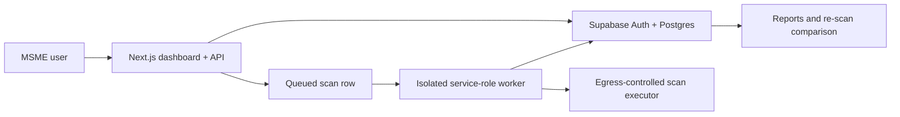

# Vyapar Shield — Technical feasibility study

## Problem and solution

Indian MSMEs increasingly use websites, payment links, cloud tools, and customer records, but rarely have a dedicated security analyst. Professional assessments are often costly; raw scanner outputs are difficult for owners to understand.

Vyapar Shield is a consent-gated health-check platform. It verifies target ownership before assessment, performs only low-impact checks, and converts technical signals into prioritised owner and developer actions in English, Hindi, or Hinglish.

## Target users

| User | Need | Vyapar Shield outcome |
|---|---|---|
| MSME owner | A clear, affordable answer | Score, business impact, first fixes, effort estimate |
| Freelancer/developer | Reliable technical evidence | Affected evidence, remediation, retest status |
| IT consultant | Repeatable client assessments | Target history, reports, audit trail |
| Hackathon judge | Evidence of safe, real security work | Verification gate, finding evidence, risk score, re-scan |

## MVP scope

1. User/business profile, account, and audit trail.
2. Target registration and ownership proof by DNS TXT; HTTP-file proof can be added through an egress-controlled worker.
3. Explicit consent before each assessment scope version.
4. Low-impact checks: TLS/HTTPS availability, headers, cookie attributes, mixed content, and fixed safe debug indicators.
5. Normalised findings with severity, evidence, owner explanation, developer guidance, remediation state, and 0–100 score.
6. English, Hindi, and Hinglish owner language variants.
7. Report data and re-scan comparison.

## Deliberately excluded

- Exploitation, payload delivery, password testing, brute force, recursive crawling, port scanning, or unauthorised target assessment.
- Subdomain discovery and deep cloud-account inspection.
- Endpoint agents, SIEM, malware scanning, and compliance certification claims.

## Feasible technical architecture

The web application creates durable, consented scan jobs. A separate worker atomically claims jobs through a database function, rejects stale consent scope versions, and persists results. This prevents public request handlers from becoming an unrestricted scanner.

## Data and security design

- Supabase Auth identifies users; `profiles`, `businesses`, and `business_members` define workspace ownership.
- Row-level security restricts targets, scans, and findings to business members.
- Verification tokens are SHA-256 hashes in the database; the plaintext token is returned once during registration.
- Consent stores user, target, scope version, timestamp, user agent, and optional IP address.
- Audit events capture business creation, target registration/verification, consent, and scan queueing.
- URL validation requires HTTPS and rejects credentials, custom ports, localhost, private IPv4, carrier-grade NAT, link-local, multicast, and local IPv6 ranges.
- A production executor must apply equivalent checks at connection time, not merely before DNS lookup, to prevent SSRF and DNS rebinding.

## Risk score

Start at 100. Deduct Critical 25, High 15, Medium 8, Low 3, and Info 0 for unresolved findings. Rank fixes by severity, customer/login impact, estimated effort, and whether the finding persists after re-scan.

## Current feasibility conclusion

The product is feasible as a hackathon MVP because the business value comes from verified assessment workflow, understandable remediation, evidence, and re-scan—not from intrusive testing. The current implementation already includes the database schema, API layer, auth/session boundary, safe job queue, worker contract, score calculation, and a no-network fixture executor for a reliable demo.

Before a real deployment, provision Supabase, run both migrations, host the worker separately, and connect only an egress-controlled executor.

